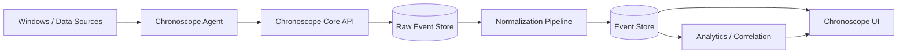

# Chronoscope — Project Specification

> **Статус документа:** Initial Architecture / Product Specification  
> **Проект:** Chronoscope  
> **Тип:** Local-first system observability / historical activity recorder  
> **Первичная платформа:** Windows  
> **Начальная версия:** `0.0.1`  
> **Назначение:** главный продуктовый и технический документ проекта. Это не README и не маркетинговая страница.

---

# 1. Краткое описание

**Chronoscope** — локальная система наблюдения за историей работы компьютера.

Её задача — не просто показывать, что происходит с системой прямо сейчас, а **сохранять контекст происходившего во времени**, чтобы пользователь мог вернуться к конкретному моменту и ответить на вопросы:

- Что происходило на компьютере в 18:42?
- Какие процессы запускались перед зависанием?
- Что изменилось между двумя датами?
- Какой процесс породил другой процесс?
- После установки какой программы появилась проблема?
- Когда приложение впервые начало вести себя необычно?
- Какие новые службы, процессы, драйверы, сетевые соединения или другие системные сущности появились?
- Что происходило непосредственно перед сбоем?
- Какие события относятся к одной причинно связанной цепочке?

Основная идея Chronoscope:

> **Компьютер должен иметь историю, которую можно исследовать так же, как историю Git, временную шкалу матча или запись полёта.**

Chronoscope не является антивирусом, SIEM, EDR, диспетчером задач, screen recorder или AI-ассистентом. Он является **локальным журналом структурированных системных событий с возможностью последующего анализа, сравнения и корреляции**.

---

# 2. Проблема

Современная операционная система генерирует огромное количество технической информации, но она распределена между разными источниками:

- процессы;
- Windows Event Log;
- системные службы;
- сетевые соединения;
- DNS;
- драйверы;
- реестр;
- файловая система;
- производительность CPU/RAM/Disk/GPU;
- установленные приложения;
- Windows Update;
- crash reports;
- startup entries;
- пользовательские приложения;
- сторонние диагностические инструменты.

Проблема не в полном отсутствии информации. Проблема в том, что эта информация разрознена, имеет разные форматы, плохо связана между собой, часто ориентирована либо на текущий момент, либо на специалистов, неудобна для сравнения «до/после» и почти не даёт единого контекста.

Chronoscope должен превращать множество технических источников в **единый поток событий**.

---

# 3. Основная продуктовая формулировка

Короткое объяснение продукта:

> **Chronoscope позволяет отмотать состояние компьютера назад и посмотреть, что происходило в нужный момент.**

Техническое объяснение:

> **Chronoscope — local-first платформа для сбора, нормализации, хранения, корреляции и анализа системных событий во времени.**

Главный вопрос продукта:

> **«Что происходило с моей системой и что изменилось?»**

---

# 4. Цели проекта

## 4.1. Главная цель

Создать работающий локальный инструмент, который непрерывно собирает события операционной системы, хранит их в единой модели и позволяет исследовать историю компьютера.

## 4.2. Технические цели

Chronoscope должен со временем уметь:

- собирать данные из нескольких независимых источников;
- приводить разные источники к общей модели событий;
- хранить большие объёмы исторических данных;
- быстро фильтровать события по времени и сущностям;
- восстанавливать цепочки процессов;
- строить временные связи между событиями;
- сравнивать два временных периода;
- вычислять статистические baseline;
- выявлять необычное поведение без обязательного ML;
- строить граф зависимостей;
- формировать incident reports;
- поддерживать плагины и дополнительные collectors;
- экспортировать данные;
- работать локально без обязательного облачного backend.

## 4.3. Продуктовые цели

Chronoscope должен быть полезен:

- технически подкованному обычному пользователю;
- разработчику;
- геймеру;
- человеку, который диагностирует проблемы на своём ПК;
- энтузиасту Windows;
- владельцу небольшого количества рабочих компьютеров;
- специалисту поддержки;
- пользователю, который хочет понимать поведение своей системы.

---

# 5. Не-цели проекта

Очень важно определить, чем Chronoscope **не должен становиться**.

## 5.1. Не антивирус

Chronoscope не должен обещать обнаружение всех вирусов, предотвращение заражений, блокировку вредоносных процессов или замену Windows Defender. В будущем он может показывать подозрительные или необычные цепочки событий, но это не делает его полноценным security product.

## 5.2. Не EDR/SIEM

Chronoscope не должен на раннем этапе превращаться в enterprise-систему централизованной безопасности. Главный сценарий — **понимание истории локальной системы**, а не SOC.

## 5.3. Не remote administration

Не нужны удалённое выполнение команд, управление чужими ПК, fleet management, remote desktop и централизованный deployment.

## 5.4. Не screen recorder

Chronoscope не должен постоянно записывать экран. Это дорого по диску, создаёт серьёзные privacy-риски и плохо соответствует модели структурированных событий.

## 5.5. Не keylogger

Chronoscope не записывает нажатия клавиш, пароли, содержимое буфера обмена по умолчанию и приватный текст пользователя.

## 5.6. Не AI-first продукт

AI не является основой Chronoscope. Возможный будущий AI-функционал допустим только как дополнительный интерфейс над уже существующими данными. Продукт должен быть полезен даже при полном удалении AI-функций.

---

# 6. Принципы проекта

## 6.1. Local-first

Основные данные пользователя находятся на его компьютере. Chronoscope должен работать без аккаунта, подписки, внешнего сервера, обязательного интернет-соединения и стороннего SaaS.

## 6.2. Privacy by default

По умолчанию:

- данные не отправляются в облако;
- API слушает только loopback interface;
- пользователь контролирует retention;
- потенциально чувствительные поля можно отключать или редактировать;
- экспорт выполняется явно;
- telemetry проекта, если когда-либо появится, должна быть opt-in.

## 6.3. Event-first

Внутреннее ядро Chronoscope строится вокруг события. Не вокруг процесса, Windows или конкретного API.

Главная сущность:

```text
Event
```

## 6.4. Immutable events

Сохранённое нормализованное событие не должно менять свой исторический смысл. Если аналитика развивается, поверх событий создаются новые результаты анализа.

## 6.5. Архитектурная формула

> **Collectors observe. Normalizers structure. Storage persists. Analytics interprets. UI explains.**

Collector наблюдает. Normalizer структурирует. Storage сохраняет. Analytics интерпретирует. UI объясняет.

---

# 7. Общая архитектура



В первой архитектуре есть два основных runtime-компонента:

1. **Chronoscope Agent**
2. **Chronoscope Core**

Полноценный UI появляется позже.

---

# 8. Chronoscope Agent

## 8.1. Назначение

Agent — Windows-native процесс, находящийся максимально близко к операционной системе и источникам данных.

Его обязанности:

- запуск collectors;
- получение сырых событий;
- минимальная валидация;
- формирование `RawEvent` envelope;
- временная локальная буферизация;
- доставка событий в Core;
- health/status информация;
- graceful shutdown.

Agent не должен:

- выполнять долгую аналитику;
- строить граф событий;
- принимать продуктовые решения;
- напрямую управлять основной БД;
- содержать UI;
- знать внутреннюю структуру аналитических модулей.

## 8.2. Язык

Основной выбор: **C# / .NET**.

Причины:

- хорошая интеграция с Windows;
- удобная работа с Windows API;
- доступ к Event Log и ETW;
- удобный background service;
- сильная типизация;
- высокая производительность;
- хороший async runtime;
- возможность в будущем оформить Agent как Windows Service.

## 8.3. Collector interface

```csharp
public interface IEventCollector
{
    string Name { get; }

    Task StartAsync(
        IRawEventSink sink,
        CancellationToken cancellationToken
    );
}
```

Планируемые collectors:

```text
ProcessCollector
WindowsEventLogCollector
SysmonCollector
PerformanceCollector
NetworkCollector
DnsCollector
ServiceCollector
DriverCollector
RegistryCollector
StartupCollector
WindowsUpdateCollector
ApplicationInventoryCollector
CrashCollector
SteamCollector
DockerCollector
GitCollector
CustomPluginCollector
```

## 8.4. Первый collector

Для `0.0.1` реализуется только `ProcessCollector`.

События:

```text
process.started
process.exited
```

Минимальные данные:

- timestamp;
- PID;
- parent PID, если доступен;
- process name;
- executable path, если доступен;
- command line, если разрешено и доступно;
- user/SID, если доступно;
- exit code, если доступен;
- source-specific payload.

Для первой итерации допустим более простой Windows-механизм наблюдения за процессами, даже если позже он будет заменён на более надёжный источник. Цель `0.0.1` — проверить pipeline.

---

# 9. Chronoscope Core

## 9.1. Назначение

Core — логическое ядро системы.

Его обязанности:

- принимать raw events;
- валидировать envelope;
- обеспечивать idempotency;
- сохранять raw events;
- запускать normalizers;
- сохранять normalized events;
- предоставлять API;
- выполнять query operations;
- позже — correlation;
- позже — analytics;
- позже — diff engine.

## 9.2. Язык

Основной выбор: **Python**.

Причины:

- высокая скорость разработки;
- удобство работы с данными;
- сильная экосистема аналитики;
- простое прототипирование;
- удобная реализация API;
- хорошая пригодность для будущего statistical analysis.

## 9.3. Backend stack

```text
Python
FastAPI
Pydantic
SQLAlchemy
Alembic
SQLite
Uvicorn
pytest
httpx
```

Дополнительные технологии подключаются только при реальной необходимости.

---

# 10. Почему Agent и Core разделены

## 10.1. Изоляция платформы

Agent знает про Windows. Core знает про Chronoscope.

В будущем возможно:

```text
Chronoscope.Agent.Windows
Chronoscope.Agent.Linux
Chronoscope.Agent.MacOS
```

без переписывания Core.

## 10.2. Изоляция прав

Некоторые collectors могут потребовать elevated privileges. Core необязательно должен работать с такими же правами.

## 10.3. Независимое развитие

Agent оптимизируется под стабильный сбор. Core — под хранение, API и аналитику.

## 10.4. Воспроизводимость

Сохранённые raw events можно повторно прогнать через новую версию Core без повторного сбора.

---

# 11. Event Pipeline

```mermaid
flowchart TD
    Source[Windows Source]
    Collector[Collector]
    RawEvent[RawEvent]
    Buffer[Agent Buffer]
    Ingest[Core Ingest API]
    RawStore[(Raw Store)]
    Normalizer[Normalizer]
    Event[Normalized Event]
    EventStore[(Event Store)]

    Source --> Collector
    Collector --> RawEvent
    RawEvent --> Buffer
    Buffer --> Ingest
    Ingest --> RawStore
    RawStore --> Normalizer
    Normalizer --> Event
    Event --> EventStore
```



Ключевой принцип:

> **Raw event сохраняется до нормализации.**

Это позволяет повторно обработать исторические данные, если схема или normalizer изменились.

---

# 12. RawEvent

`RawEvent` — универсальная оболочка вокруг source-specific payload.

```json
{
  "schema_version": 1,
  "event_id": "01K...",
  "collector": "windows.process",
  "collector_version": "0.0.1",
  "observed_at": "2026-09-18T10:42:15.281Z",
  "source_timestamp": "2026-09-18T10:42:15.220Z",
  "host_id": "host_...",
  "boot_id": "boot_...",
  "payload_type": "process_start",
  "payload": {
    "pid": 9812,
    "parent_pid": 4312,
    "name": "notepad.exe",
    "path": "C:\\Windows\\System32\\notepad.exe"
  }
}
```

`source_timestamp` — время источника. `observed_at` — время, когда Chronoscope увидел событие. Они могут различаться из-за задержек, batch delivery или особенностей источника.

---

# 13. Normalized Event

Normalized Event — центральная сущность Chronoscope.

```json
{
  "schema_version": 1,
  "id": "evt_...",
  "timestamp": "2026-09-18T10:42:15.220Z",
  "observed_at": "2026-09-18T10:42:15.281Z",
  "type": "process.started",
  "source": "windows.process",
  "host_id": "host_...",
  "boot_id": "boot_...",
  "actor": {
    "type": "process",
    "id": "proc_...",
    "name": "explorer.exe"
  },
  "subject": {
    "type": "process",
    "id": "proc_...",
    "name": "notepad.exe"
  },
  "attributes": {
    "pid": 9812,
    "parent_pid": 4312,
    "executable": "C:\\Windows\\System32\\notepad.exe",
    "command_line": "notepad.exe"
  },
  "raw_event_id": "raw_...",
  "trace_id": null,
  "tags": []
}
```

---

# 14. Идентичность процесса

PID нельзя использовать как уникальную идентичность процесса во времени: PID может быть переиспользован ОС.

Chronoscope различает:

```text
PID
```

и:

```text
Process Instance ID
```

Концептуально:

```text
process_instance_id = host_id + boot_id + pid + process_start_timestamp
```

Если источник предоставляет собственный надёжный Process GUID, его можно использовать.

Правило:

> `pid = 4120` — атрибут. `process_instance_id` — идентичность конкретного экземпляра процесса.

---

# 15. Host identity

Даже local-first приложение должно иметь `host_id`.

Причины:

- экспорт данных;
- импорт исторических записей;
- возможная поддержка нескольких машин;
- защита от случайного смешивания событий разных компьютеров.

`host_id` должен быть случайным локальным идентификатором, а не hardware fingerprint, серийным номером или Microsoft account.

---

# 16. Boot identity

Каждая загрузка ОС получает `boot_id`.

Это позволяет:

- различать одинаковые PID после перезагрузки;
- группировать события по system session;
- анализировать startup sequence;
- сравнивать boots.

---

# 17. Идентификаторы

Предпочтительно использовать сортируемые по времени идентификаторы: ULID или UUIDv7.

Категории:

```text
raw_event_id
event_id
host_id
boot_id
process_instance_id
incident_id
correlation_id
```

Auto-increment integer может существовать как внутренний storage key, но не как глобальная идентичность события.

---

# 18. Event naming convention

Типы событий записываются в lowercase dot notation:

```text
process.started
process.exited
system.booted
system.shutdown
service.installed
service.started
service.stopped
network.connected
network.disconnected
dns.queried
file.created
file.modified
file.deleted
registry.value_changed
application.crashed
performance.sampled
update.installed
incident.marked
```

Правило:

```text
<domain>.<past-tense-action>
```

---

# 19. Entity model

События связывают сущности.

Минимальный `EntityRef`:

```json
{
  "type": "process",
  "id": "proc_...",
  "name": "notepad.exe"
}
```

Будущие типы:

```text
process
file
network_endpoint
dns_name
service
driver
registry_key
application
user
host
device
container
repository
game
update
```

---

# 20. Actor и Subject

`actor` — сущность, инициировавшая действие. `subject` — сущность, над которой произошло действие.

Пример сетевого соединения:

```text
chrome.exe -> network endpoint
```

Пример запуска процесса:

```text
explorer.exe -> notepad.exe
```

Пример создания файла:

```text
installer.exe -> C:\Program Files\Foo\foo.exe
```

---

# 21. Event immutability и enrichment

Нормализованное событие исторически неизменно.

Дополнительные знания хранятся отдельно:

```text
Event
  + Enrichment
  + Correlation
  + Analytics Result
```

Будущий enrichment процесса может включать:

```text
publisher
digital_signature
file_hash
product_name
version
known_application
```

Enrichment должен иметь собственную версию, timestamp и источник.

---

# 22. Correlation Engine

Correlation Engine — одна из ключевых будущих частей Chronoscope.

Пример цепочки:

```text
process.started
    ↓
dns.queried
    ↓
network.connected
    ↓
file.created
    ↓
process.started
```

Механизмы корреляции:

- parent-child process relation;
- одинаковый `process_instance_id`;
- временная близость;
- общий file path;
- network connection;
- source-specific GUID;
- причинные правила.

Correlation не изменяет исходные события. Она создаёт отдельные relationships.

---

# 23. Relationship model

Будущая структура:

```json
{
  "id": "rel_...",
  "type": "process.parent_of",
  "from": "proc_parent",
  "to": "proc_child",
  "valid_from": "2026-09-18T10:42:15Z",
  "source": "process_normalizer",
  "confidence": 1.0
}
```

Типы:

```text
process.parent_of
process.connected_to
process.created_file
process.modified_file
process.queried_dns
application.owns_process
event.caused_by
event.related_to
```

---

# 24. Time model

Chronoscope — временная система, поэтому работа со временем должна быть строгой.

## Storage

Все timestamps хранятся в UTC.

## UI

UI отображает время в локальной timezone пользователя.

## Precision

Сохраняется максимально разумная точность источника.

## Ordering

Нельзя считать, что порядок получения равен реальному порядку событий. Полезны отдельные поля:

```text
source_timestamp
observed_at
ingested_at
```

Позже возможен collector sequence number.

---

# 25. Database strategy

## 25.1. Версия 0.x

Основная БД: **SQLite**.

Причины:

- zero configuration;
- один локальный файл;
- хороший вариант для desktop/local-first;
- транзакции;
- индексы;
- JSON;
- отсутствие отдельного DB server.

Рекомендуемые настройки, которые нужно подтверждать benchmark'ами:

```text
WAL mode
foreign_keys = ON
synchronous = NORMAL
busy_timeout configured
```

PostgreSQL в `0.0.1` не нужен: он усложняет installer, конфигурацию, credentials, ports и backup.

---

# 26. Начальная схема хранения

Минимум две логические таблицы:

```text
raw_events
events
```

Пример:

```sql
CREATE TABLE raw_events (
    id TEXT PRIMARY KEY,
    schema_version INTEGER NOT NULL,
    collector TEXT NOT NULL,
    collector_version TEXT NOT NULL,
    observed_at TEXT NOT NULL,
    source_timestamp TEXT,
    host_id TEXT NOT NULL,
    boot_id TEXT,
    payload_type TEXT NOT NULL,
    payload_json TEXT NOT NULL,
    ingested_at TEXT NOT NULL
);
```

```sql
CREATE TABLE events (
    id TEXT PRIMARY KEY,
    schema_version INTEGER NOT NULL,
    timestamp TEXT NOT NULL,
    observed_at TEXT,
    type TEXT NOT NULL,
    source TEXT NOT NULL,
    host_id TEXT NOT NULL,
    boot_id TEXT,
    actor_type TEXT,
    actor_id TEXT,
    actor_name TEXT,
    subject_type TEXT,
    subject_id TEXT,
    subject_name TEXT,
    attributes_json TEXT NOT NULL,
    raw_event_id TEXT,
    FOREIGN KEY(raw_event_id) REFERENCES raw_events(id)
);
```

Это не окончательная схема. В раннем проекте важнее гибкость.

---

# 27. Индексы

В ранних версиях:

```text
events(timestamp)
events(type, timestamp)
events(actor_id, timestamp)
events(subject_id, timestamp)
raw_events(collector, source_timestamp)
```

Не создавать десятки индексов «на будущее». Каждый индекс занимает место и замедляет insert.

---

# 28. JSON attributes

`attributes` в раннем Chronoscope разумно хранить как JSON.

Причины:

- event types быстро меняются;
- невозможно заранее спроектировать все поля;
- разные domains имеют разные структуры;
- миграции проще.

Когда появятся стабильные query patterns, часто используемые поля можно денормализовать.

---

# 29. Raw storage

Raw payload следует хранить достаточно близко к источнику.

Преимущества:

- reprocessing;
- debugging;
- миграция normalizers;
- исправление parser bugs;
- разработка аналитики на старых данных.

Недостаток — расход диска. Поэтому позже raw storage получает отдельный retention policy.

---

# 30. Будущая cold storage стратегия

При большом объёме данных можно перейти к схеме:

```text
SQLite = hot metadata / recent events
Parquet = historical event partitions
DuckDB = analytical queries
```

Например:

```text
data/
├── chronoscope.db
└── archive/
    └── 2026/
        └── 09/
            └── 18/
                ├── events.parquet
                └── raw.parquet
```

Этого **не должно быть в 0.0.1**.

---

# 31. API

API локальный и версионированный.

Prefix:

```text
/api/v1
```

## Health

```http
GET /api/v1/health
```

```json
{
  "status": "ok",
  "version": "0.0.1",
  "database": "ok"
}
```

## Status

```http
GET /api/v1/status
```

Будущий ответ:

```json
{
  "core": "running",
  "agent": {
    "connected": true,
    "last_seen_at": "..."
  },
  "events": {
    "total": 12419,
    "last_minute": 34
  }
}
```

## Raw ingest

```http
POST /api/v1/ingest/raw-events
```

Сразу разумно поддержать batch envelope:

```json
{
  "events": [
    { "...": "..." },
    { "...": "..." }
  ]
}
```

## Events query

```http
GET /api/v1/events
```

Фильтры:

```text
limit
cursor
type
from
to
actor_id
subject_id
source
```

## Event detail

```http
GET /api/v1/events/{event_id}
```

---

# 32. Pagination

Для больших timeline не использовать глубокий `OFFSET` как долгосрочную стратегию.

Предпочтителен cursor pagination, где cursor включает:

```text
timestamp
event_id
```

Порядок:

```text
ORDER BY timestamp DESC, id DESC
```

---

# 33. Local API security

Core по умолчанию слушает только:

```text
127.0.0.1
```

не `0.0.0.0`.

Минимум для `0.0.1`:

- loopback-only;
- configurable port;
- request size limits;
- input validation.

Позже можно добавить локальный shared secret между Agent и Core.

---

# 34. Backpressure и доставка

Collector может генерировать события быстрее, чем Core успевает принимать.

Agent должен иметь bounded buffer:

```text
Collector
   ↓
Bounded Channel
   ↓
Batch Sender
   ↓
Core
```

При временной недоступности Core допустим retry. В `0.0.1` достаточно in-memory buffer.

Модель доставки:

> **at-least-once delivery + idempotent ingest**

Agent может повторить отправку. Core не создаёт дубль благодаря стабильному `raw_event_id`.

---

# 35. Logging

Оба runtime-компонента должны использовать structured logs.

Плохо:

```text
something failed
```

Лучше:

```json
{
  "level": "error",
  "component": "process_collector",
  "event": "collector_read_failed",
  "exception": "...",
  "timestamp": "..."
}
```

Достаточно console logs и rotating local file. Полноценный observability stack вокруг самого Chronoscope не нужен.

---

# 36. Конфигурация

Пример ранней конфигурации:

```toml
[core]
host = "127.0.0.1"
port = 7342

[storage]
database_path = "./data/chronoscope.db"

[agent]
batch_size = 50
flush_interval_ms = 500

[collectors.process]
enabled = true
capture_command_line = true
capture_user = true

[privacy]
redact_command_line_patterns = []
```

Формат может быть TOML/YAML/JSON. Главное — не хранить настройки в коде.

---

# 37. Privacy model

Chronoscope потенциально видит чувствительные данные. Например command line может содержать токены, пароли, API keys, приватные пути и URL query parameters.

Privacy нельзя оставлять «на потом».

Возможные уровни:

### Minimal

- process name;
- PID;
- parent relation;
- timestamps.

### Standard

- executable path;
- user;
- command line с redaction.

### Extended

- дополнительные детальные collectors.

На раннем этапе достаточно configuration flags.

---

# 38. Redaction

Будущий privacy filter:

```text
Collector
   ↓
Raw Payload
   ↓
Privacy Filter
   ↓
RawEvent
   ↓
Core
```

Примеры:

```text
--token=***
--password=***
Authorization=***
```

Автоматическая redaction не может быть идеальной, поэтому пользователь должен иметь возможность полностью отключить чувствительные поля.

---

# 39. Data retention

Chronoscope не должен бесконтрольно расти на диске.

Будущие политики:

```text
raw events: 7 days
normalized events: 90 days
aggregates: unlimited
```

или ограничение:

```text
maximum database size: 20 GB
```

В `0.0.1` автоматическое удаление необязательно, но архитектура не должна мешать его добавить.

---

# 40. Product UX — долгосрочное направление

Главный UI должен строиться вокруг времени, а не вокруг списка модулей.

Ключевые экраны:

1. Timeline
2. Incident
3. Process graph
4. Compare
5. Entity history
6. Statistics
7. Storage/settings

---

# 41. Timeline

Пример:

```text
18:41:20 process.started     steam.exe
18:41:24 network.connected   steam.exe → ...
18:41:30 process.started     cs2.exe
18:41:42 performance.sample  CPU 78%
18:42:03 application.crashed foo.exe
```

Фильтры:

- период;
- event type;
- application;
- process;
- source;
- severity;
- tag.

Timeline должен быть виртуализирован и работать с большим количеством событий.

---

# 42. Incident Marker

Пользователь отмечает момент:

> «Вот здесь что-то пошло не так».

Например hotkey:

```text
Ctrl + Alt + F12
```

Создаётся `incident.marked`.

```json
{
  "timestamp": "...",
  "note": "Игра начала лагать"
}
```

UI показывает контекст, например `-5 минут / +5 минут` вокруг incident.

---

# 43. Process Tree / Process Graph

Chronoscope должен восстанавливать экземпляры процессов и их связи:

```text
explorer.exe
└── steam.exe
    └── cs2.exe
        ├── crashpad_handler.exe
        └── ...
```

По клику на процесс в будущем:

- start;
- exit;
- parent;
- children;
- CPU/RAM history;
- network;
- DNS;
- files;
- crashes;
- first seen;
- last seen.

---

# 44. Compare Mode

Пользователь выбирает Point A и Point B. Chronoscope показывает наблюдаемые изменения:

```text
Applications
Services
Drivers
Startup
Processes
Network
System Updates
Performance
Configuration
```

Пример:

```text
Between Sep 15 and Sep 18:

+ FooService
+ foo.sys driver
+ foo.exe startup entry
+ 3 previously unseen processes
+ Windows update KB...
```

Chronoscope не обязан автоматически заявлять причину. Он показывает факты и контекст.

---

# 45. Baselines и anomaly detection

Chronoscope может постепенно изучать обычное поведение приложений без AI.

Пример:

```text
discord.exe

RAM median: 740 MB
P95:        1.1 GB
Today:      2.8 GB
```

Методы:

- median;
- percentiles;
- rolling average;
- standard deviation;
- EWMA;
- frequency;
- first seen;
- rare relation detection;
- time-of-day distributions.

Первые anomaly rules должны быть статистическими и объяснимыми:

```text
chrome.exe used 3.2x its 30-day median RAM
```

или:

```text
This parent-child process relationship was not observed in the previous 30 days.
```

---

# 46. Plugin architecture — будущее

Chronoscope должен иметь возможность расширяться, но plugin SDK **не нужен в 0.0.1**.

Будущая модель:

```text
Chronoscope Core
├── Windows Agent
├── Linux Agent
├── Docker Plugin
├── Steam Plugin
├── Git Plugin
├── Browser Plugin
├── 1C Plugin
└── Custom Plugin
```

Plugin описывает capabilities, event types, schema, permissions и version.

---

# 47. Возможное расширение в сторону 1С

В будущем можно создать отдельный 1C domain/collector, например:

```text
1C client started
database opened
background job started
long operation
connection lost
client crashed
```

Это должно быть расширением, а не зависимостью Core от 1С.

---

# 48. Репозиторий

Рекомендуется monorepo:

```text
chronoscope/
│
├── README.md
├── LICENSE
├── CONTRIBUTING.md
├── SECURITY.md
├── CHANGELOG.md
├── .editorconfig
├── .gitignore
│
├── docs/
│   ├── PROJECT_SPEC.md
│   ├── EVENT_MODEL.md
│   ├── ARCHITECTURE.md
│   ├── PRIVACY.md
│   ├── DEVELOPMENT.md
│   │
│   └── decisions/
│       ├── 0001-monorepo.md
│       ├── 0002-agent-core-separation.md
│       ├── 0003-unified-event-model.md
│       ├── 0004-sqlite-first.md
│       └── 0005-raw-event-retention.md
│
├── agent/
│   ├── Chronoscope.Agent.sln
│   ├── src/
│   │   ├── Chronoscope.Agent/
│   │   ├── Chronoscope.Agent.Abstractions/
│   │   ├── Chronoscope.Agent.Transport/
│   │   └── Chronoscope.Agent.Collectors.Windows/
│   └── tests/
│       ├── Chronoscope.Agent.Tests/
│       └── Chronoscope.Agent.Collectors.Windows.Tests/
│
├── core/
│   ├── pyproject.toml
│   ├── chronoscope/
│   │   ├── api/
│   │   ├── application/
│   │   ├── domain/
│   │   ├── infrastructure/
│   │   ├── normalization/
│   │   ├── analytics/
│   │   └── main.py
│   ├── migrations/
│   └── tests/
│
├── frontend/
│   └── README.md
│
├── shared/
│   ├── schemas/
│   └── fixtures/
│
├── scripts/
│   ├── dev.ps1
│   ├── test.ps1
│   └── reset-dev-data.ps1
│
└── data/
    └── .gitkeep
```

---

# 49. Core package structure

```text
core/chronoscope/
│
├── api/
│   ├── dependencies.py
│   ├── errors.py
│   └── routes/
│       ├── health.py
│       ├── ingest.py
│       └── events.py
│
├── application/
│   ├── ingest/
│   │   ├── ingest_raw_event.py
│   │   └── ingest_batch.py
│   └── queries/
│       ├── list_events.py
│       └── get_event.py
│
├── domain/
│   ├── events/
│   │   ├── event.py
│   │   ├── raw_event.py
│   │   ├── entity_ref.py
│   │   └── event_type.py
│   └── hosts/
│       ├── host_id.py
│       └── boot_id.py
│
├── normalization/
│   ├── registry.py
│   └── windows/
│       └── process_normalizer.py
│
├── infrastructure/
│   ├── config/
│   ├── database/
│   │   ├── engine.py
│   │   ├── models.py
│   │   └── repositories.py
│   └── logging/
│
├── analytics/
│   └── README.md
│
└── main.py
```

---

# 50. Layer rules

## Domain

`domain/` не зависит от FastAPI, SQLAlchemy, SQLite, HTTP или Windows.

## Application

Реализует use cases:

```text
IngestRawEvent
ListEvents
GetEvent
```

Координирует repositories, normalizers и transaction.

## Infrastructure

Реализует конкретные технологии: SQLite, filesystem, logging, config.

## API

Принимает HTTP, валидирует transport schema, вызывает use case и сериализует ответ. API не должен самостоятельно писать SQL.

Архитектурный поток:

```text
API
 ↓
Use Case
 ↓
Repository
```

---

# 51. Shared schemas

Agent и Core должны иметь общий формальный контракт.

В `shared/schemas/`:

```text
raw-event.schema.json
ingest-batch.schema.json
event.schema.json
```

Agent и Core тестируются против одинаковых схем.

Позже можно перейти к generated client/OpenAPI, если это станет полезно.

---

# 52. Schema versioning

Каждый transport object имеет:

```text
schema_version
```

Backward-compatible изменения могут добавлять optional fields. Breaking changes требуют новой major schema version.

Core должен явно отклонять неподдерживаемую схему вместо молчаливого неправильного разбора.

---

# 53. Architecture Decision Records

Все важные архитектурные решения фиксируются в `docs/decisions/`.

Шаблон:

```markdown
# ADR-0003: Unified Event Model

## Status
Accepted

## Context
...

## Decision
...

## Consequences
...
```

Первые ADR:

```text
0001 Use monorepo
0002 Separate Agent and Core
0003 Use unified event model
0004 SQLite-first storage
0005 Preserve raw events
0006 Windows-first
0007 Local-only API
0008 No microservices
```

---

# 54. Почему не microservices

Chronoscope — один локальный продукт. Не нужны Kafka, Redis, RabbitMQ, Kubernetes и service mesh на раннем этапе.

Основной подход:

> **Modular monolith + отдельный platform agent.**

Если когда-либо появится реальная необходимость разделить Core, это можно сделать позже.

---

# 55. Frontend

Frontend не входит в `0.0.1`.

Предварительный стек:

```text
TypeScript
React
Vite
```

Он подходит для сложных timeline, charts и graph UI.

Для desktop packaging позже можно рассмотреть локальный web UI, WebView2 host или другой desktop shell. Не нужно принимать решение о wrapper до появления работающего интерфейса.

---

# 56. Почему сначала не UI

Главные риски Chronoscope — не внешний вид.

Главные риски:

- корректность event model;
- стабильность collection;
- объём данных;
- идентичность процессов;
- ordering;
- storage;
- privacy;
- query performance.

Поэтому сначала строится data pipeline.

---

# 57. CLI

В ранних версиях CLI полезнее GUI.

Будущие команды:

```text
chronoscope status
chronoscope events
chronoscope event <id>
chronoscope doctor
```

Пример:

```text
$ chronoscope status

Chronoscope Core   running
Chronoscope Agent  connected
Database           ok

Events total       12,419
Last minute        34
Database size      18.2 MB
```

---

# 58. Testing strategy

## Unit tests

Проверяют normalizers, value objects, validation, ID generation и domain rules.

## Contract tests

Проверяют совместимость Agent ↔ Core и общих JSON schemas.

## Repository tests

Используют временную SQLite DB и проверяют insert, duplicate handling, queries, ordering, migrations.

## Integration tests

```text
POST raw event
   ↓
raw event stored
   ↓
normalized
   ↓
GET event returns it
```

## End-to-end test

Критический сценарий `0.0.1`:

```text
Start Core
Start Agent
Start notepad.exe
Close notepad.exe
Query API
```

В результате существуют `process.started` и `process.exited`.

---

# 59. Test fixtures

`shared/fixtures/`:

```text
windows/
├── process_start_001.json
├── process_start_missing_path.json
├── process_exit_001.json
└── malformed_event.json
```

Так normalizer можно тестировать без реального запуска процессов.

---

# 60. Error handling

Chronoscope должен различать:

- invalid input;
- unsupported schema version;
- duplicate event;
- database failure;
- normalizer failure;
- collector failure;
- transport failure.

Одно плохое событие не должно убивать pipeline.

Если normalizer не понимает payload, raw event сохраняется, failure логируется, данные не уничтожаются.

---

# 61. Performance philosophy

Не оптимизировать без измерений, но заранее знать ключевые метрики:

```text
events/sec collected
events/sec ingested
events/sec normalized
DB write latency
query latency
database size/day
raw bytes/day
memory usage Agent
memory usage Core
queue depth
dropped events
```

Будущие benchmark datasets:

```text
100k events
1m events
10m events
```

И нагрузки:

```text
10 events/sec
100 events/sec
1,000 events/sec
```

---

# 62. Reliability

Agent должен уметь переживать:

- Core restart;
- временную loopback failure;
- collector exception;
- Windows sleep/resume;
- shutdown.

Core должен переживать malformed request, duplicate event, migration и interrupted transaction.

`0.0.1` не обязан идеально решать все сценарии, но ошибки должны быть видимыми и диагностируемыми.

---

# 63. Startup model

Dev mode:

```text
Terminal 1:
python -m chronoscope

Terminal 2:
dotnet run --project agent/...
```

Позже:

```text
Chronoscope Core
Chronoscope Agent Windows Service
Chronoscope Desktop UI
```

Installer появляется после стабилизации runtime-компонентов.

---

# 64. Development environment

Минимально:

```text
Windows
Git
Python
.NET SDK
PowerShell
SQLite tools optional
```

Docker не обязателен. Agent взаимодействует с Windows host, поэтому контейнеризация не является полезной целью сама по себе.

---

# 65. Dependency policy

Не добавлять dependency только ради небольшого удобства.

Для существенной зависимости нужно понимать:

- зачем она нужна;
- license;
- состояние проекта;
- transitive dependencies;
- возможность замены.

Особая осторожность с Windows hooks, packet capture, kernel drivers, native DLL и elevated services.

---

# 66. Security model

Минимальные правила:

- Core bind только localhost;
- никакого remote code execution API;
- никакого arbitrary SQL endpoint;
- никакого shell endpoint;
- строгая валидация payload;
- ограничение размера request;
- безопасные file paths;
- database path не приходит от HTTP клиента;
- чувствительные данные минимизируются в логах.

---

# 67. Privilege model

Agent должен работать с минимально необходимыми правами.

Нельзя запускать весь Chronoscope как Administrator только потому, что один collector когда-либо потребует elevated privileges.

---

# 68. Open-source направление

Chronoscope хорошо подходит для open-source.

Возможные лицензии:

```text
MIT
Apache-2.0
GPLv3
AGPLv3
```

Для permissive open-source разумно рассмотреть MIT или Apache-2.0. Окончательное решение нужно принять до публичного релиза.

---

# 69. Documentation philosophy

Документация — часть проекта.

Минимум:

```text
README.md
PROJECT_SPEC.md
ARCHITECTURE.md
EVENT_MODEL.md
PRIVACY.md
DEVELOPMENT.md
SECURITY.md
ADRs
```

`README.md` — короткий вход. `PROJECT_SPEC.md` — этот документ — объясняет проект глубже.

---

# 70. Coding philosophy

## Сначала ясность

Понятный код важнее clever abstractions.

## Не строить framework заранее

Если пока есть один collector, не нужно создавать 20 уровней plugin infrastructure.

## Vertical slices

Каждая ранняя итерация должна проходить через всю систему:

```text
Windows process
→ Agent
→ Transport
→ Core
→ Raw storage
→ Normalizer
→ Event storage
→ Query
```

Это лучше, чем месяцами строить отдельные абстракции без работающего продукта.

---

# 71. Definition of Done

Функция считается законченной, когда:

- код работает;
- есть адекватный error handling;
- есть tests нужного уровня;
- обновлена документация;
- нет очевидного privacy regression;
- есть способ проверить функцию вручную;
- создана migration, если изменилась БД;
- рассмотрена schema/API version, если менялся contract.

---

# 72. Versioning

До `1.0.0` проект развивается быстро:

```text
0.0.1
0.0.2
0.1.0
0.2.0
...
1.0.0
```

Условно:

- `0.0.x` — фундаментальные технические slices;
- `0.x.0` — заметные пользовательские возможности;
- `1.0.0` — стабильный продуктовый контракт.

---

# 73. Scope Chronoscope 0.0.1

`0.0.1` — **не MVP продукта**. Это первый полностью работающий архитектурный vertical slice.

Главный критерий:

> **Windows process event проходит весь путь от операционной системы до query API.**

## Repository

- monorepo;
- базовая документация;
- `.gitignore`;
- `.editorconfig`;
- лицензия или placeholder;
- dev scripts.

## Agent

- C# project;
- collector abstraction;
- `ProcessCollector`;
- `RawEvent` model;
- in-memory buffer;
- HTTP sender;
- graceful cancellation;
- structured logging.

## Core

- FastAPI;
- config;
- health endpoint;
- ingest endpoint;
- RawEvent validation;
- raw storage;
- process normalizer;
- normalized event storage;
- events query endpoint;
- event detail endpoint.

## Storage

- SQLite;
- Alembic migrations;
- initial schema;
- basic indexes;
- WAL configuration.

## Schemas

- raw event schema v1;
- event schema v1;
- fixtures.

## Tests

- normalizer tests;
- repository tests;
- ingest integration test;
- manual E2E process start/exit validation.

---

# 74. Что НЕ входит в 0.0.1

```text
Sysmon
ETW optimization
network monitoring
DNS
files
registry
services
drivers
performance telemetry
GPU
Steam
1C
React
desktop UI
timeline visualization
charts
process graph UI
correlation engine
anomaly detection
baseline
compare mode
incident UI
cloud
accounts
authentication
remote agents
Docker deployment
PostgreSQL
ClickHouse
Redis
Kafka
plugins SDK
installer
auto-update
AI
```

Если во время разработки появляется желание добавить это — записать в backlog и продолжить `0.0.1`.

---

# 75. 0.0.1 End-to-End scenario

1. Запустить Core:

```bash
python -m chronoscope
```

2. Проверить:

```http
GET /api/v1/health
```

3. Запустить Agent.

4. Запустить `notepad.exe`.

5. Закрыть Notepad.

6. Выполнить:

```http
GET /api/v1/events?type=process.started
```

В выдаче есть `notepad.exe`.

7. Выполнить:

```http
GET /api/v1/events?type=process.exited
```

В выдаче есть завершение того же process instance.

8. Перезапустить Core — история остаётся в SQLite.

9. Повторно отправить один `RawEvent` — дубликат не создаётся.

После этого:

```text
git tag v0.0.1
```

---

# 76. Критерии качества 0.0.1

Версия успешна, если:

- pipeline работает end-to-end;
- ProcessCollector не падает при обычном использовании;
- Core не теряет данные при штатном restart;
- duplicate event безопасно обрабатывается;
- `schema_version` присутствует;
- raw payload сохраняется;
- normalized Event сохраняется;
- query по времени и типу работает;
- unit/integration tests проходят;
- README объясняет запуск;
- PROJECT_SPEC соответствует реальной архитектуре.

---

# 77. Логическая последовательность следующих версий

## 0.0.2 — See

Цель: увидеть поток событий удобнее.

- простой CLI;
- базовая local web page;
- pagination;
- filters;
- event detail.

## 0.0.3 — Identify

Цель: корректно идентифицировать process instances.

- boot session;
- stable process instance ID;
- parent-child mapping;
- process detail.

## 0.0.4 — Observe

Цель: добавить второй и третий источник, например Windows Event Log и basic performance samples.

## 0.0.5 — Connect

Цель: первые relationships, process tree и related events.

## 0.1.0 — Timeline

Первый настоящий пользовательский milestone:

- usable timeline;
- filters;
- search;
- event details;
- process history.

## 0.2.0 — Incident

- incident marker;
- context window;
- export report.

## 0.3.0 — Compare

- two-point comparison;
- новые процессы;
- новые приложения/службы там, где есть данные;
- environment diff.

## 0.4.0 — Analytics

- historical statistics;
- first/last seen;
- frequency;
- baseline;
- explainable anomalies.

---

# 78. Product success criteria

Chronoscope нельзя оценивать только количеством функций.

Хороший продуктовый критерий:

> Пользователь может ответить на вопрос «Что произошло с моим компьютером вчера в 21:43?» за несколько минут, не открывая пять разных системных инструментов.

Более сильный критерий:

> Пользователь начинает держать Chronoscope включённым постоянно, потому что история особенно ценна после возникновения проблемы.

---

# 79. Technical success criteria

На зрелом этапе Chronoscope должен:

- работать днями без restart;
- потреблять умеренные ресурсы;
- не мешать обычной работе ПК;
- сохранять большой timeline;
- быстро открывать недавние события;
- не повреждать БД при штатных сбоях;
- позволять replay raw data;
- поддерживать новые collectors без изменения ядра;
- иметь тестируемую event schema;
- обеспечивать воспроизводимую аналитику.

---

# 80. Главные риски проекта

## Слишком много данных

Решения: sampling, filtering, batching, retention, aggregation, cold storage.

## Высокое потребление ресурсов

Observability tool не должен сам становиться причиной лагов. CPU, RAM, disk writes и database growth должны измеряться.

## Privacy

Нужны local-only, redaction, configurable detail и понятная документация.

## Scope explosion

Chronoscope очень легко превратить одновременно в Task Manager, Wireshark, Process Monitor, EDR, Grafana, debugger и system cleaner.

Главный фильтр любой новой функции:

> **Помогает ли она понять историю системы во времени?**

## Premature abstraction

Слишком ранний plugin framework может замедлить проект. Абстракции добавляются там, где уже есть реальная граница.

---

# 81. Архитектурные инварианты

Эти правила желательно не нарушать без отдельного ADR:

1. Core не зависит от Windows API.
2. Agent не содержит продуктовой аналитики.
3. Raw events сохраняются до потери source-specific информации.
4. Normalized Event имеет версию схемы.
5. PID не является идентичностью process instance.
6. Исторические events immutable.
7. API по умолчанию local-only.
8. Cloud не является обязательной зависимостью.
9. Analytics строится поверх событий, а не вместо них.
10. UI не читает SQLite напрямую.
11. Database schema изменяется только через migrations.
12. Collectors не знают о UI.
13. Один сломанный event не останавливает pipeline.
14. Chronoscope должен быть полезен без AI.

---

# 82. Терминология компонентов

```text
Chronoscope Agent
Chronoscope Core
Chronoscope UI
Chronoscope Event
Chronoscope RawEvent
Chronoscope Collector
Chronoscope Normalizer
Chronoscope Event Store
Chronoscope Correlation Engine
Chronoscope Analytics Engine
Chronoscope Incident
```

Один термин должен обозначать одно понятие во всём проекте.

---

# 83. Naming / branding

Название **Chronoscope** хорошо отражает идею:

```text
chrono = time
scope = observe / inspect
```

Смысл: инструмент наблюдения за системой через время.

Визуальные метафоры:

- timeline;
- lens;
- rewind;
- history;
- layers;
- traces.

Интерфейс должен оставаться техническим и читаемым, а не уходить в sci-fi ради sci-fi.

---

# 84. Главная продуктовая метафора

Если Task Manager отвечает:

> «Что происходит сейчас?»

то Chronoscope отвечает:

> **«Что происходило тогда?»**

Если Event Viewer отвечает:

> «Вот технические записи разных подсистем.»

то Chronoscope должен отвечать:

> **«Вот история событий вокруг конкретного момента и их связи.»**

---

# 85. Будущий пользовательский сценарий: игровой лаг

Пользователь играет. В `21:43` начинаются фризы. Он нажимает incident hotkey.

Позже открывает Chronoscope и видит:

```text
21:38 ─────────────────────────── 21:48

21:40:12 Steam background update started
21:41:08 chrome.exe memory increased
21:42:52 disk utilization reached 100%
21:43:00 INCIDENT: "Game started freezing"
21:43:06 service X started
21:43:09 process Y created
21:44:20 disk utilization returned to normal
```

Пользователь раскрывает событие, переходит к процессу, видит parent и его историю.

Это конечная продуктовая ценность Chronoscope.

---

# 86. Будущий пользовательский сценарий: Compare

Пользователь говорит:

> «В понедельник компьютер работал нормально, а в среду начал тормозить.»

Он выбирает Monday 18:00 и Wednesday 18:00.

Chronoscope показывает:

```text
Applications
+ Foo 3.1

Startup
+ FooUpdater.exe

Services
+ FooUpdateService

Processes
+ 4 new recurring process names

Performance
chrome.exe median RAM:
1.2 GB → 2.4 GB
```

Chronoscope не обязан объявлять виновника. Он предоставляет наблюдаемые изменения и контекст.

---

# 87. Почему проект технически интересный

Chronoscope объединяет:

- Windows internals;
- event collection;
- backend;
- API design;
- databases;
- time-series thinking;
- event sourcing concepts;
- analytics;
- statistics;
- graph relationships;
- desktop tooling;
- frontend visualization;
- privacy;
- performance;
- system design.

При этом его можно развивать вертикально и получать работающий результат на каждом этапе.

---

# 88. Почему проект подходит для долгого развития

После первого рабочего продукта остаются реальные направления:

```text
better collectors
storage optimization
timeline UX
correlation
graph visualization
statistics
compare engine
incident reports
plugins
cross-platform
export/import
privacy controls
performance tuning
```

Это не искусственные фичи ради количества. Каждая усиливает основную идею.

---

# 89. Первые конкретные задачи

После создания репозитория:

1. Положить этот документ в `docs/PROJECT_SPEC.md`.
2. Создать ADR `0001-agent-core-separation.md`.
3. Определить `RawEvent v1` до написания collector.
4. Определить `Event v1`.
5. Создать FastAPI health endpoint.
6. Подключить SQLite + migration.
7. Реализовать ingest RawEvent вручную через curl.
8. Реализовать ProcessNormalizer.
9. Реализовать GET events.
10. Только после этого подключить C# Agent.

Так Core сначала проверяется синтетическими events, а затем подключается реальный источник.

---

# 90. Рекомендуемый порядок разработки 0.0.1

```text
1. Repository structure
2. PROJECT_SPEC
3. ADRs
4. JSON schemas
5. Core domain models
6. SQLite + migrations
7. Raw repository
8. Event repository
9. Process normalizer
10. Ingest API
11. Query API
12. Synthetic integration test
13. Agent skeleton
14. ProcessCollector
15. Batch transport
16. E2E test
17. Documentation cleanup
18. Tag v0.0.1
```

---

# 91. Что считать победой

На данном этапе победа — не красивый интерфейс и не пользователи.

Победа выглядит так:

```text
Windows
   ↓
ProcessCollector
   ↓
RawEvent
   ↓
Chronoscope Core
   ↓
SQLite
   ↓
Normalizer
   ↓
Event
   ↓
GET /api/v1/events
```

И этот pipeline:

- понятен;
- протестирован;
- документирован;
- расширяем;
- не зависит от случайных хаков;
- не требует облака;
- реально работает на компьютере разработчика.

После этого Chronoscope перестаёт быть идеей и становится системой.

---

# 92. Краткий технический манифест

> **История системы ценнее отдельного snapshot.**

> **Сырые данные нужно сохранять до интерпретации.**

> **Разные источники должны сходиться в единую модель событий.**

> **События должны быть связаны со временем и сущностями.**

> **Collector наблюдает, но не делает выводов.**

> **Аналитика должна быть воспроизводимой и объяснимой.**

> **Пользовательские данные должны оставаться локальными по умолчанию.**

> **Chronoscope должен быть полезен без AI.**

> **Сложность добавляется только тогда, когда она решает существующую проблему.**

> **Каждая версия должна оставлять после себя работающую вертикальную систему.**

---

# 93. Итог

**Chronoscope** — это не просто логгер процессов.

ProcessCollector в `0.0.1` — только первая проверка архитектуры.

Конечная идея значительно шире:

> **Построить локальную временную модель жизни компьютера.**

Chronoscope должен постепенно научиться видеть:

- что произошло;
- когда это произошло;
- какая сущность участвовала;
- какая сущность была затронута;
- что происходило непосредственно до и после;
- какие события относятся друг к другу;
- что появилось впервые;
- что изменилось между двумя состояниями;
- насколько текущее поведение отличается от исторического.

Но проект должен идти к этой цели постепенно.

Первая версия не пытается понимать весь компьютер. Она доказывает, что Chronoscope умеет сделать самую важную вещь:

> **увидеть событие, сохранить его историю и вернуть её пользователю позже.**

Именно вокруг этого фундамента строится всё остальное.
